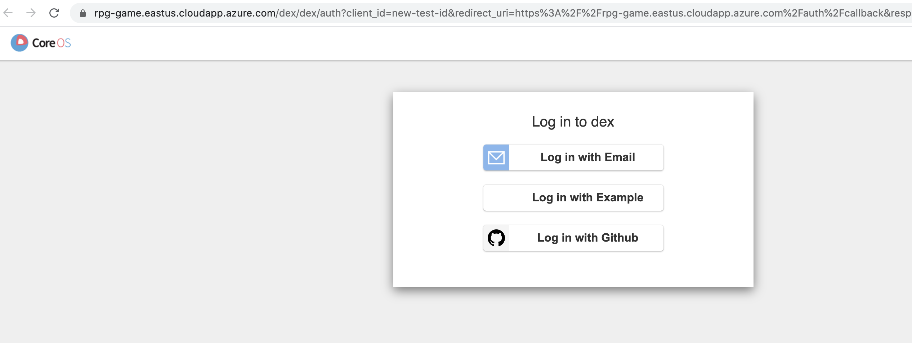
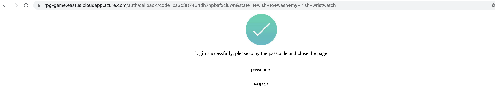
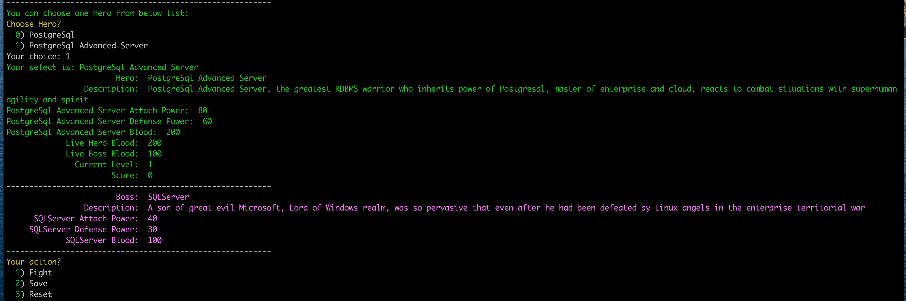
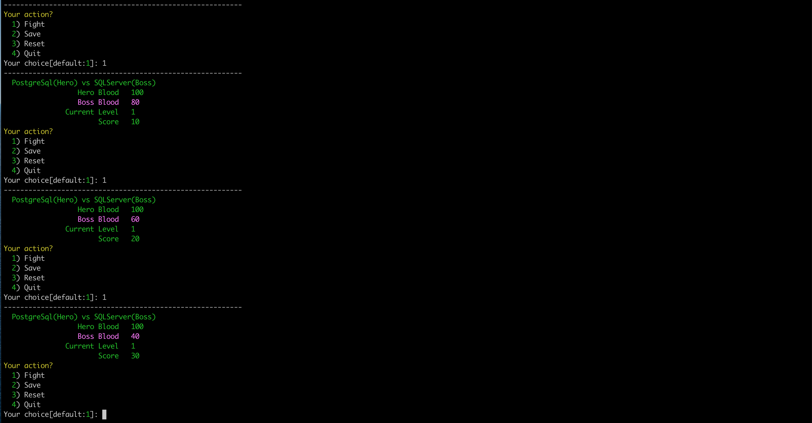
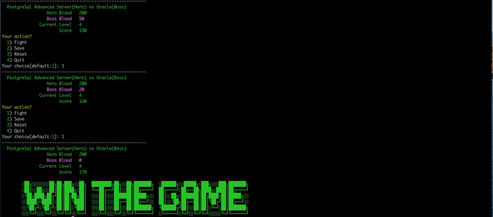
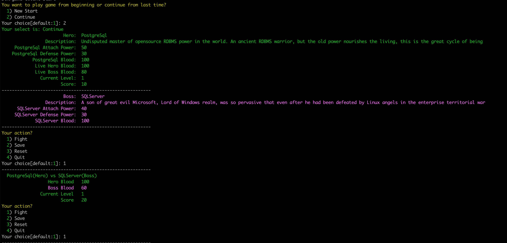

# game_client


## build and run

Build game-client application with cmd `make build`
Before you run game-client, you need touch a configure file under your $HOME direcotry, for example:

`touch $HOME/.game/config`

configure file `config` content is like this:

```
id_token = "your token content"
```
Note: if you run this application first time, you can leave id_token is empty
Then run cmd  `make run` to start your application.

## Usage
When the application is started first time, it will open url of `https://rpg-game.eastus.cloudapp.azure.com/login` in your default browser and then you will see , choose one authetication method to login and you will get one 6 digits , copy that passcode to cli to login dev. Next time you start application, it will get token from $HOME/.game/config configure file to login into system.

Once you login the system successfully, you can start game to start.

You can choose a hero as a player to start to fight.

- Start Game

- Choose Hero

- Chosse Action

- Win the Game



Also you can save game results and exit game, when next time you will continue to fight, you can select `continue` to start.

- Continue Game


